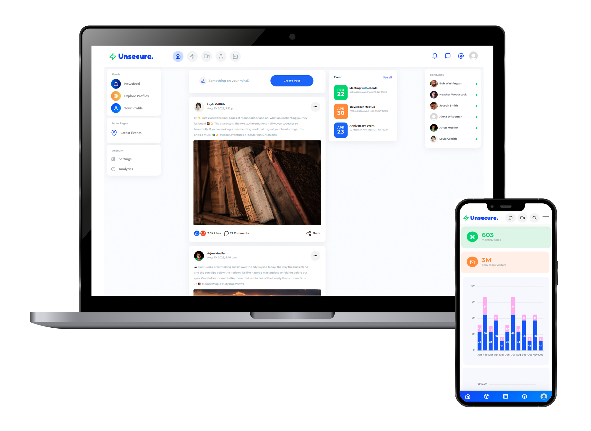

# SENG406 Unsecure (Django) App - 2023 edition

This app has been developed in an unsecure way on purpose for SENG406 students to train themselves at identifying and fixing common vulnerabilities and design issues in software systems. 

Most of the vulnerabilities hidden in the app are instances of [OWASP Top 10 2021](https://owasp.org/Top10/).


## Initial app

This app is a social media platform that has been built with a modern design for both desktop and mobile.



## ✨ How to use it

> OPTION 1 - Clone the repo

```bash
$ git clone git@eng-git.canterbury.ac.nz:fgi18/seng406-asg3-23.git
```
> OPTION 2 - Download and unzip from Learn

```bash
$ unzip seng406-asg3-23.zip
```

### 👉 Set Up for `Unix`, `MacOS` and `Windows Subsystem for Linux`

> Create a virtual environment

```bash
$ cd seng406-asg3-23
$ virtualenv -p python3 .venv
$ . .venv/bin/activate
$ pip3 install -r requirements.txt
```

> Set up the database. This is not necessary for this project as we provide you with a pre-filled database, but this is typically part of Django first-time run.

```bash
$ python manage.py makemigrations
$ python manage.py migrate
```

> Collect static files. This is necessary for some [Django deployment magic](https://docs.djangoproject.com/en/4.2/howto/static-files/deployment/).

```bash
$ python manage.py collectstatic
```

> Run the console SMTP server (mock email)

```bash
$ python -m aiosmtpd -n -l localhost:8025
```

Emails will print to the console instead of being sent out. See the bottom of `settings.py` for more details.

> Start the app

```bash
$ python manage.py runserver
```

At this point, the app runs at `http://127.0.0.1:8000/`. 
